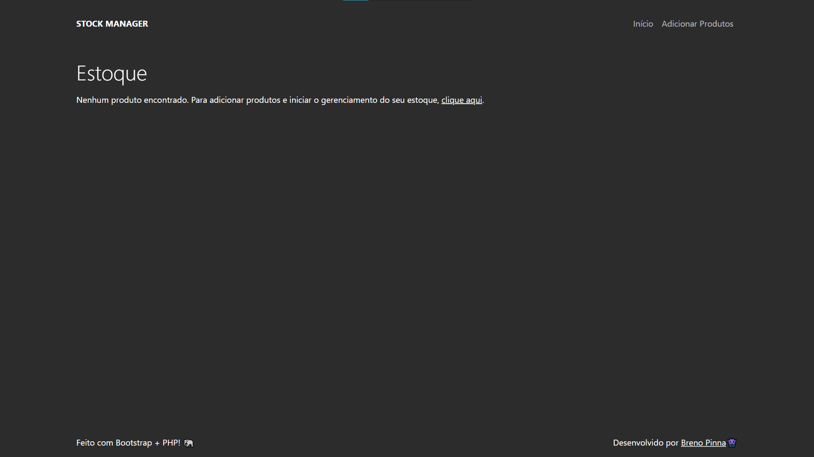
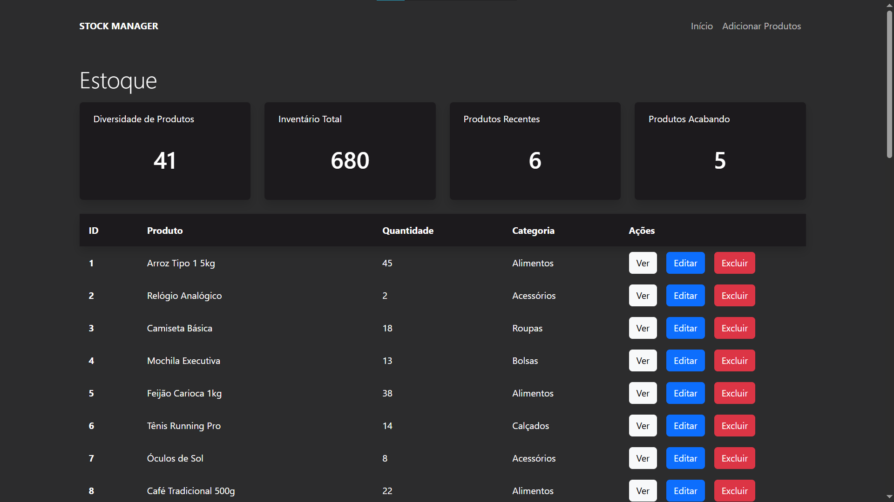
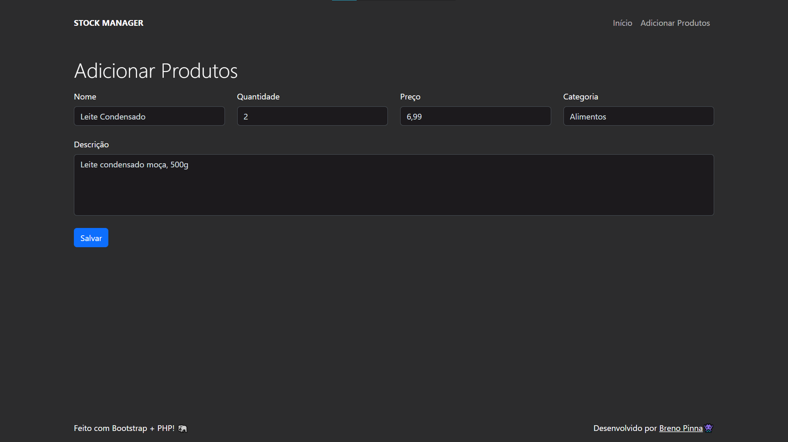
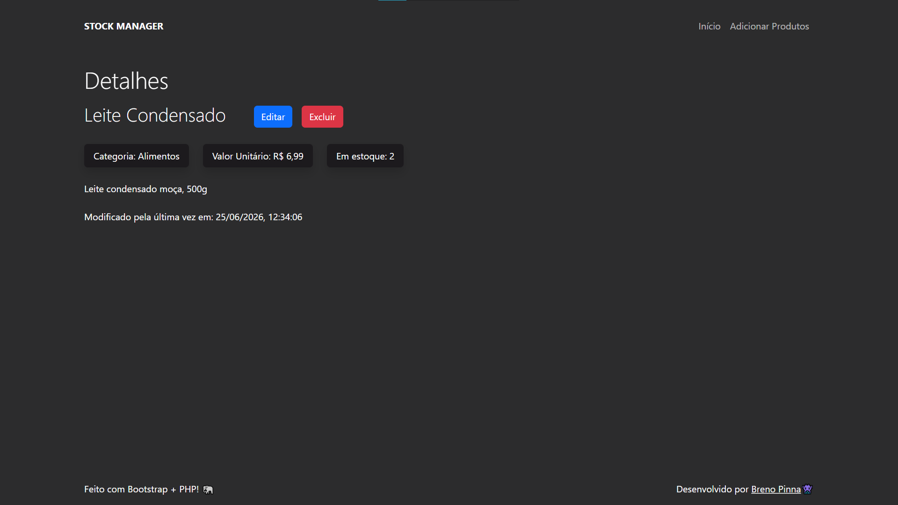
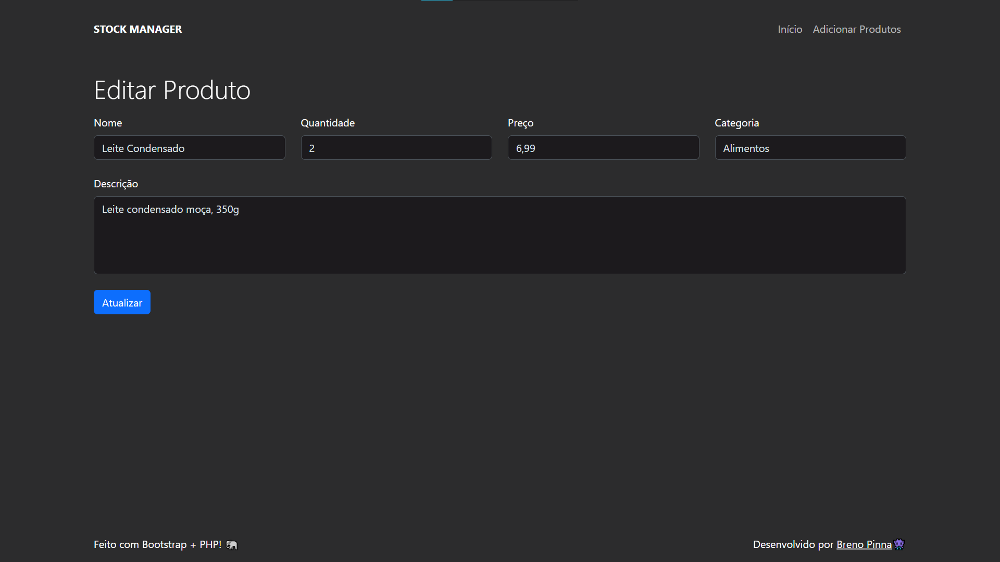

# Stock Manager 📦

## 🔍 Sobre o projeto

O **STOCK MANAGER** foi concebido para resolver o problema de descentralização e falta de controle sobre mercadorias armazenadas.

Esta documentação detalha as regras de negócio, fluxos de usuário e comportamentos operacionais do sistema. O foco principal é descrever as utilidades de cada tela e como elas se conectam para formar o ciclo de vida completo de gerenciamento de um inventário (CRUD).

## 🛠️ Tecnologias utilizadas

Frontend 👾

- HTML & CSS
- JavaScript
- Bootstrap

Backend 👨‍💻

- PHP
- MySQL

Hospedagem 🌐

- InfinityFree

## 📗 Guia do projeto

### Regras de Negócio

Antes de navegar pelas telas, é importante entender os pilares lógicos da aplicação:

1. **Recálculo em Cadeia:** Qualquer inserção, deleção ou atualização gera um recálculo instantâneo das quatro métricas do topo da página principal.
2. **Ciclo de Vida de Deleção:** A ação de "Excluir" a partir de qualquer uma das telas remove o registro da persistência de dados. Caso o item excluído seja o último da base de dados, a aplicação automaticamente altera seu estado de renderização e retorna para a visualização de tela vazia.

### Funcionalidades

O sistema foi desenhado para guiar o usuário por todas as etapas do gerenciamento de estoque:

#### Tela Principal (Vazia)

Na etapa inicial, quando o banco de dados está limpo (sem produtos), o sistema atua na **prevenção de quebra de fluxo**. Em vez de exibir uma tabela vazia, instrui ativamente o operador e o direciona através de um link para o cadastro.

Tela principal vazia

#### Painel de Monitoramento (Home)

Assim que o banco possui pelo menos um item, a **central de monitoramento** é carregada. Ela é dividida em indicadores automáticos (Diversidade, Inventário Total, Produtos Recentes e Produtos Acabando) e na listagem estruturada, que oferece rotas para `Ver`, `Editar` ou `Excluir`.

Painel de monitoramento e listagem de produtos

#### Cadastro de Produtos

A interface de **Cadastro** atua como validadora de entrada de dados (Nome, Quantidade, Preço, Categoria e Descrição). A submissão processa os dados no banco e atualiza instantaneamente os indicadores da Home.

Criação de um novo produto

#### Detalhes do Produto

Para conferência individual e auditoria, a tela de **Detalhes** exibe o registro de marcas de tempo (_timestamps_) com a data e hora da última alteração. Também oferece um ambiente seguro para ações modificadoras.

Visualização de produto específico (Acessada pelo botão `Ver`)

#### Atualização de Produto

Para mitigar erros humanos, a interface de **Atualização** faz uma consulta ao banco e pré-carrega os campos com o estado atual do objeto. Ao atualizar, o motor PHP renova automaticamente o _timestamp_ de modificação.

Edição de produto (Acessada pelo botão `Editar`)

## Agradecimentos

Obrigado por apoiar meu projeto! Desenvolvido por **Breno Pinna**.

Qualquer sugestão ou dúvida, mande um oi no discord! username: **b011**
